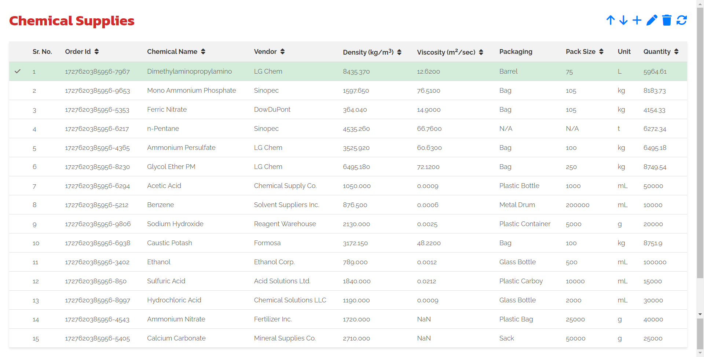
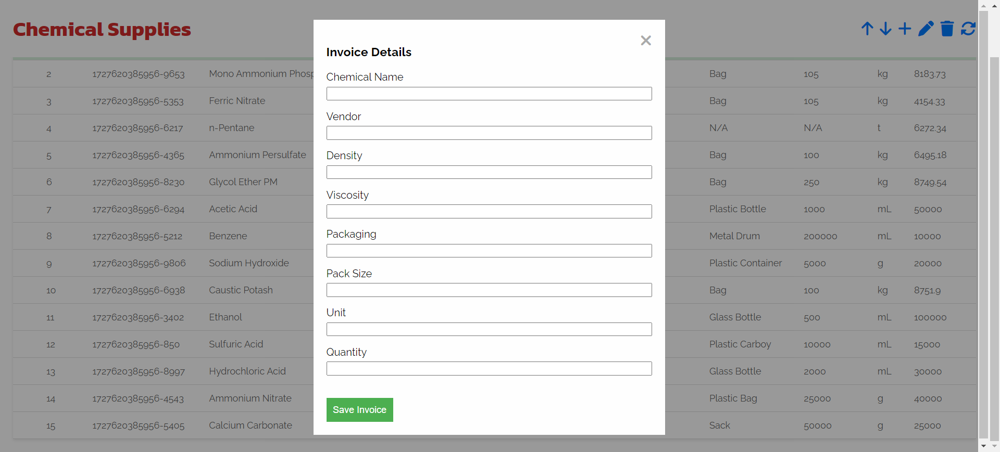
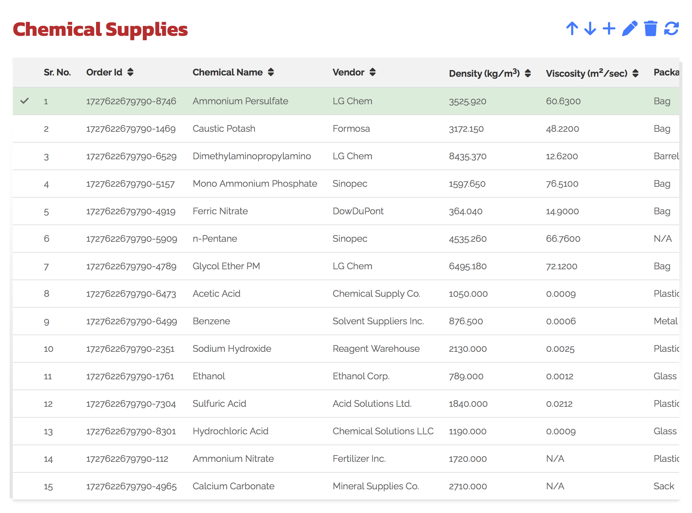
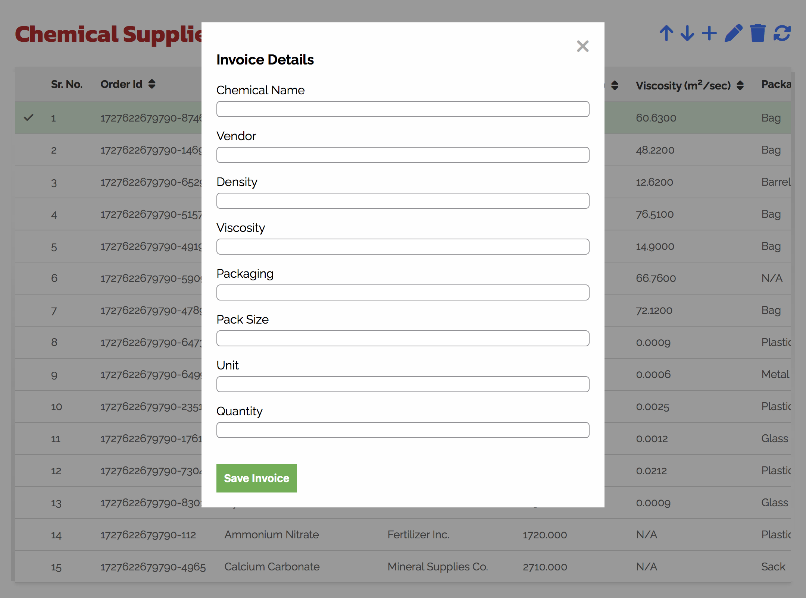
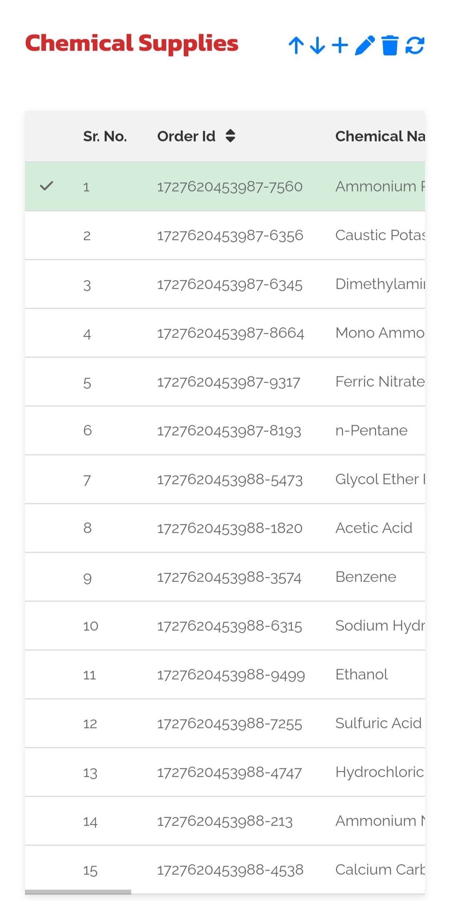
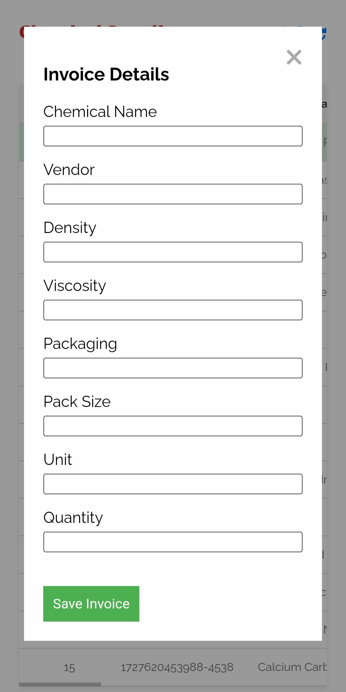

# Chemical Inventory Management System

### Overview

The goal was to build a simple Chemical Inventory Management System using **HTML, CSS, and JavaScript**, adhering to the provided problem statement. The application allows users to manage a list of chemicals, providing features such as adding, deleting, editing, sorting, and moving rows. It is designed to be simple, fast, and does not use any frameworks or external libraries.

### Features

- **Add New Entry:** Add a new chemical entry with fields such as chemical name, vendor, density, viscosity, packaging, pack size, unit, and quantity.
- **Edit Existing Entry:** Modify the details of a selected chemical entry through a modal form.
- **Delete Entry:** Remove the selected row with a confirmation prompt to avoid accidental deletions.
- **Move Row Up/Down:** Reorder the rows by moving them up or down.
- **Reset Table:** Restore the table to its original state with predefined data.
- **Save Data:** Save the table's current state to `localStorage` for persistence across sessions.
- **Sort Functionality:** Click on the column headers to sort the data in ascending or descending order.

### Project Requirements

1. **JSON Data:** A predefined JSON array consisting of invoice data, each containing:
   - `chemical_name`
   - `vendor`
   - `density`
   - `viscosity`
   - `packaging`
   - `pack_size`
   - `unit`
   - `quantity`
2. **Technologies:** The project is built using JavaScript, HTML, and CSS without any external libraries or frameworks.

### Design Approach

1. **UI Design:** The interface features a clean table layout with intuitive action buttons (add, edit, delete, etc.). A modal form is used for adding and editing entries.
2. **Data Persistence:** The application leverages `localStorage` for persisting data across browser sessions. Users can reset the table to its default state as needed.
3. **Sorting Logic:** The table supports sorting by each column. Clicking a column header toggles sorting between ascending and descending.
4. **Form Validation:** The modal form ensures that all fields are filled correctly before adding or editing an entry. This minimizes errors in user input.
5. **Responsive Design:** Basic responsiveness is implemented, making the app usable on both desktop and mobile devices.

### How to access

1. **Clone the repository**

   - `git clone https://github.com/siddheshrm/invoice-details`
   - `cd invoice-details`
   - Open `index.html` file in any browser to view the application.

2. **Custom Domain Hosting:** The project is hosted [here](https://invoice-tracker.siddheshmestri.online/)

3. **GitHub Page Hosting:** Alternatively, you can access the project [here](https://siddheshrm.github.io/invoice-details/)

### Screenshots

1. **Desktop**
   

   

2. **Tablet**
   

   

3. **Mobile**
   

   

### About me

You can learn more about me and explore my other projects on my [portfolio website](https://siddheshmestri.online/)
